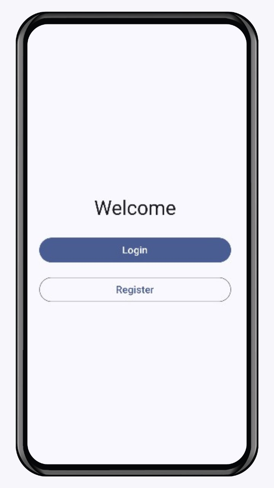
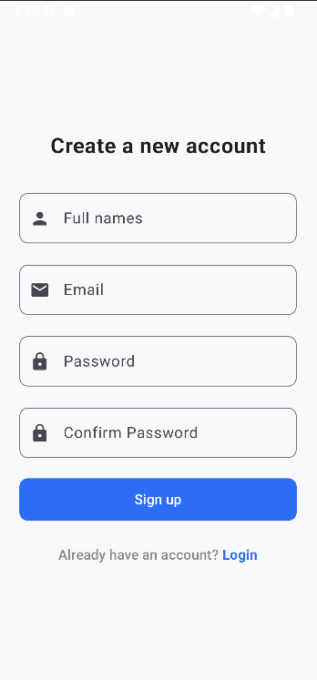
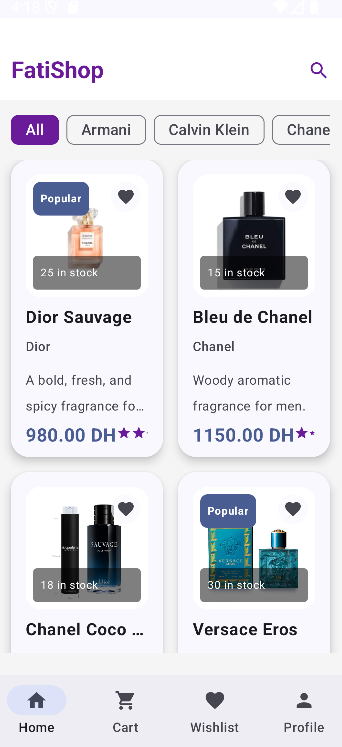
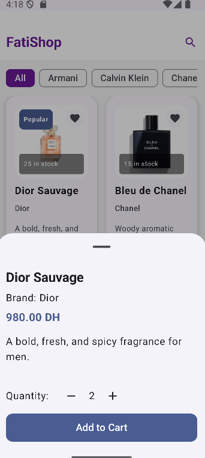
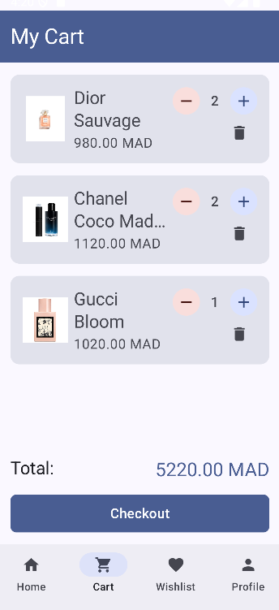
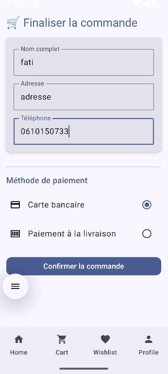
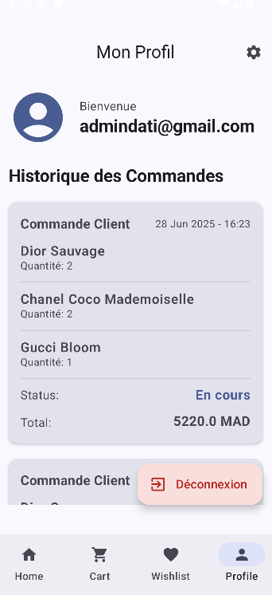

# FatiShop 🛍️

## 👤 Réalisé par :
**Nom et Prénom :** Fatima Zahrae El Ghiouan  
**Email :** fatimazahraeelghiouan69@gmail.com

---

## 📦 Dépendances à installer :
- Kotlin
- Jetpack Compose
- Navigation Compose
- Hilt (Dependency Injection)
- Firebase (Authentication + Firestore)
- Coil (Chargement des images)
- Gradle (version compatible avec Jetpack Compose)

---

## 📱 Description du projet :

**FatiShop** est une application mobile e-commerce développée avec Jetpack Compose.  
Elle permet aux utilisateurs de :

- Naviguer dans un catalogue de produits.
- Consulter les détails d’un produit.
- Ajouter des articles au panier.
- Passer une commande (Checkout).
- Consulter leurs commandes et le statut de livraison.
- Gérer leur profil utilisateur.
- Ajouter des produits aux favoris.
- S’authentifier (inscription et connexion avec Firebase).

---

## 🧱 Structure du projet :

com.example.fatishop/
├── features/
│   ├── auth/          # Authentification
│   ├── cart/          # Gestion panier
│   ├── checkout/      # Paiement
│   ├── home/          # Accueil produits
│   ├── productdetails/# Détails produits
│   ├── profile/       # Profil utilisateur
│   ├── welcome/       # Écran d'accueil
│   └── wishlist/      # Favoris
├── shared/
│   ├── model/         # Data classes
│   ├── repository/    # Couche données
│   ├── navigation/    # Navigation compose
│   └── utils/         # Helpers
├── ui.theme/          # Design system
└── images/            # Captures d’écran de l'application
    ├── welcome.jpg
    ├── login.jpg
    ├── register.jpg
    ├── home.jpg
    ├── detailProduct.jpg
    ├── cart.jpg
    ├── checkout.jpg
    └── profil.jpg

---

## 🖼️ Captures d'écran de l'application :

### 🏠 Écran d’accueil

### 🔐 Écran de connexion

### 📝 Écran d’inscription

### 🛍️ Page d’accueil des produits

### 📄 Détails d’un produit

### 🛒 Panier

### 💳 Checkout

### 👤 Profil utilisateur

---

## ✅ Remarques finales :
- Le dossier `images/` contient les captures d’écran utilisées ci-dessus.
- L’application est construite avec une architecture modulaire moderne.
- Ce projet a été réalisé dans le cadre d’une formation Android avec Kotlin + Jetpack Compose.

---
